Тема: Терминал и командная оболочка

операционной системы Linux

Цель работы: приобрести опыт работы с командной строкой ОС Linux,
изучить основные команды (работа с датой, пользователями, процессами,
справкой).

Ход работы:

1.  Запуск терминала

> 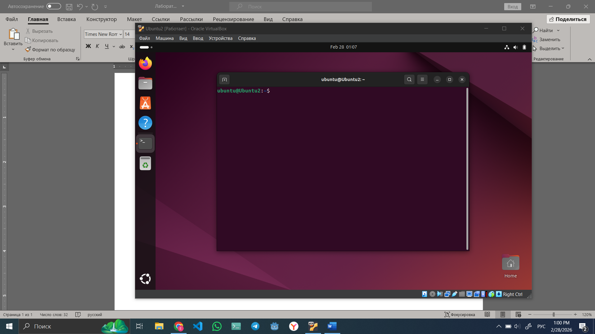
> 

2.  Особенности работы с правами

> Для работы в терминале Ubuntu требуются права пользователя root, но, к
> сожалению, по умолчанию, он недоступен, поэтому для выполнения
> некоторых (не всех) команд надо писать sudo \<команда\>, и
> подтверждать свои права вводом пароля. И не пугайтесь того, что его не
> видно в терминале! Наберите точно по памяти, по окончании ввода
> нажмите
>
> 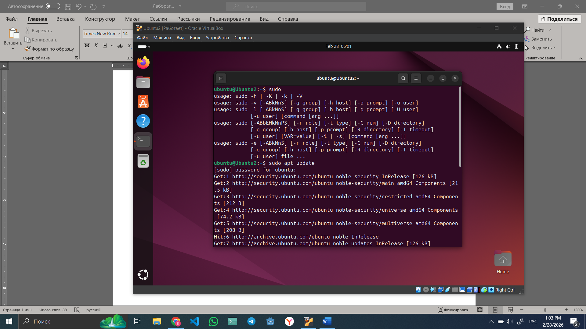

3.  Получение справки

> Для получения краткой справки по командам используется ключ \--help.
> Проверим это на команде ls:
>
> Команда вывела краткое руководство со всеми доступными ключами.
>
> 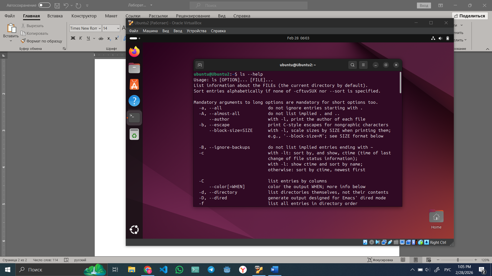

4.  Практика выполнения базовых команд

  ---------------------------------------------------------------
  Команда                         Описание
  ------------------------------- -------------------------------
  | Команда | Описание |
  | date | Показывает нынешние дату и время, по системным часам ядра.|
  | oclock |Обычные часы (графическое приложение-часы).|

  finger                          Отображение информации о
                                  пользователе.

  hwclock                         Интегрированные часы (часы
                                  аппаратного обеспечения).

  uname                           Выводит информацию об
                                  используемой операционной
                                  системе.

  history                         Демонстрирует пронумерованный
                                  перечень команд, которые Вы
                                  исполняли.

  clear                           Чистит экран терминала.

  ls                              Указывает все файлы в текущем
                                  каталоге в алфавитном порядке.
  ---------------------------------------------------------------

> 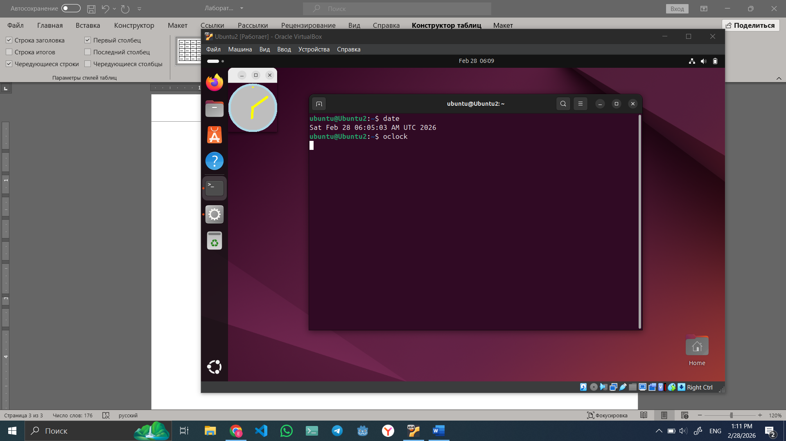
>
> 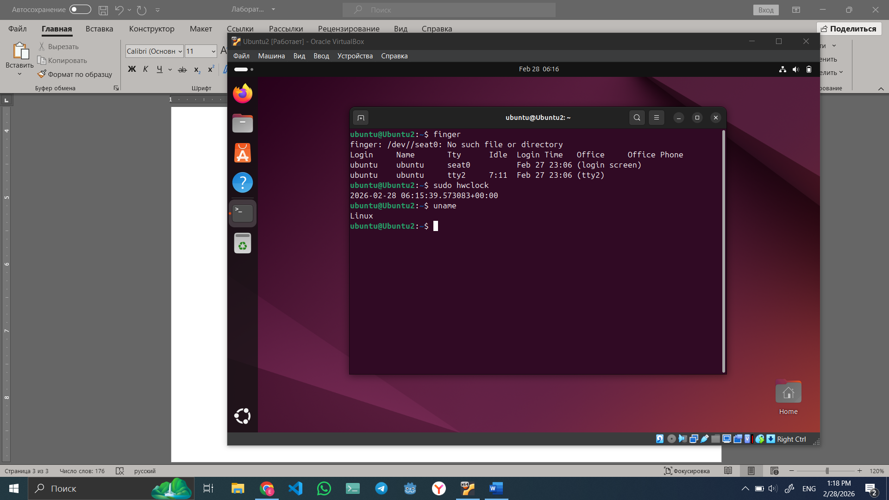
>
> 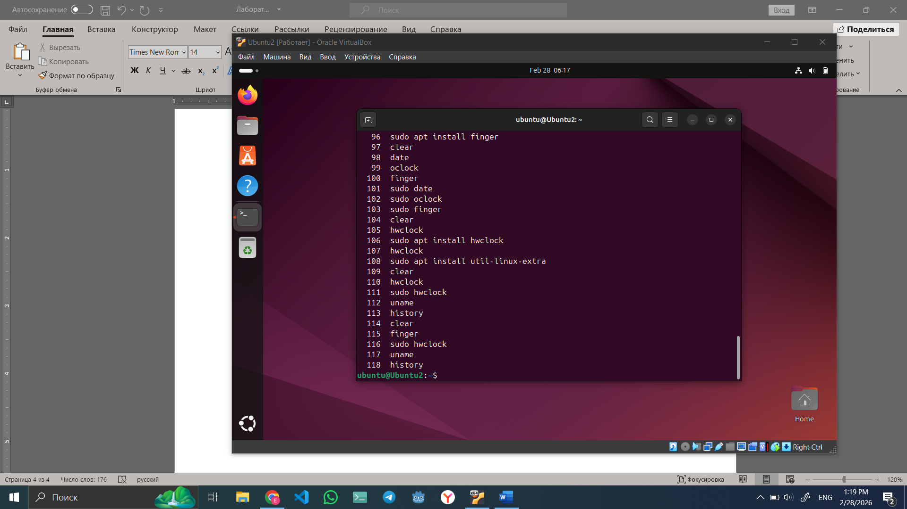
>
> 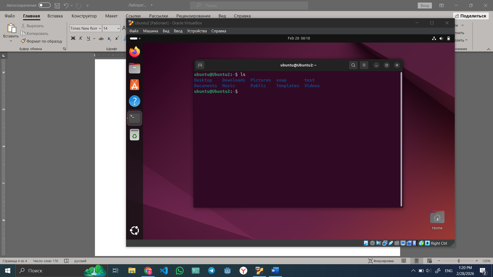

5.  Создание нового пользователя и управление группами

> Шаг 1. Создание пользователя
>
> Используем команду sudo adduser имя_пользователя. В примере создадим
> пользователя student.
>
> Процесс:

1.  Система запросит и попросит подтвердить пароль для нового
    пользователя student.

2.  Далее будет запрос на ввод дополнительной информации (Full Name,
    Room и т.д.). Эти поля можно оставить пустыми, нажимая Enter.

3.  Подтверждение корректности введенных данных (нажать Y).

> 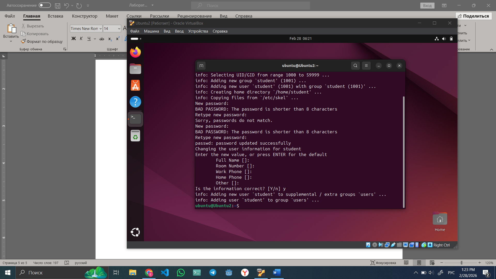
>
> Шаг 2. Добавление пользователя в группу admin
>
> В разных версиях Ubuntu группа администраторов может называться adm,
> admin или sudo. В современных версиях (14.04 и новее) это группа sudo.
>
> Добавляем пользователя student в группу sudo:
>
> sudo usermod -a -G sudo student
>
> 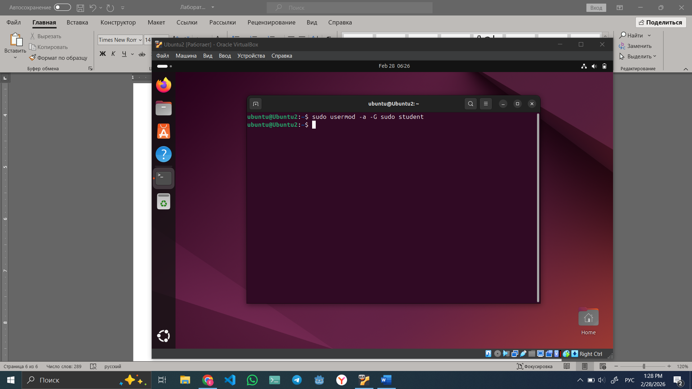
>
> Пояснение: -a (append) --- добавить, не удаляя из других групп; -G ---
> указание дополнительной группы.
>
> Шаг 3. Проверка членства в группе
>
> Проверим, что пользователь теперь в группе sudo.
>
> groups student
>
> 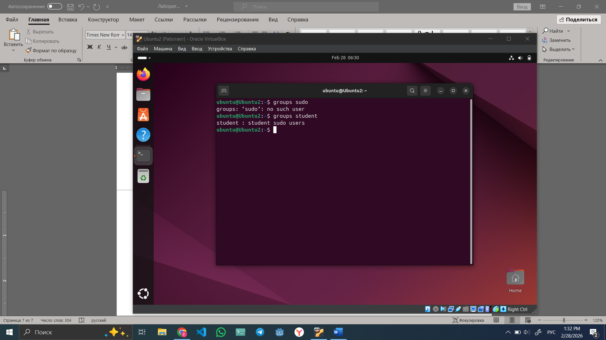
>
> Шаг 4. Вход в систему под новым пользователем
>
> 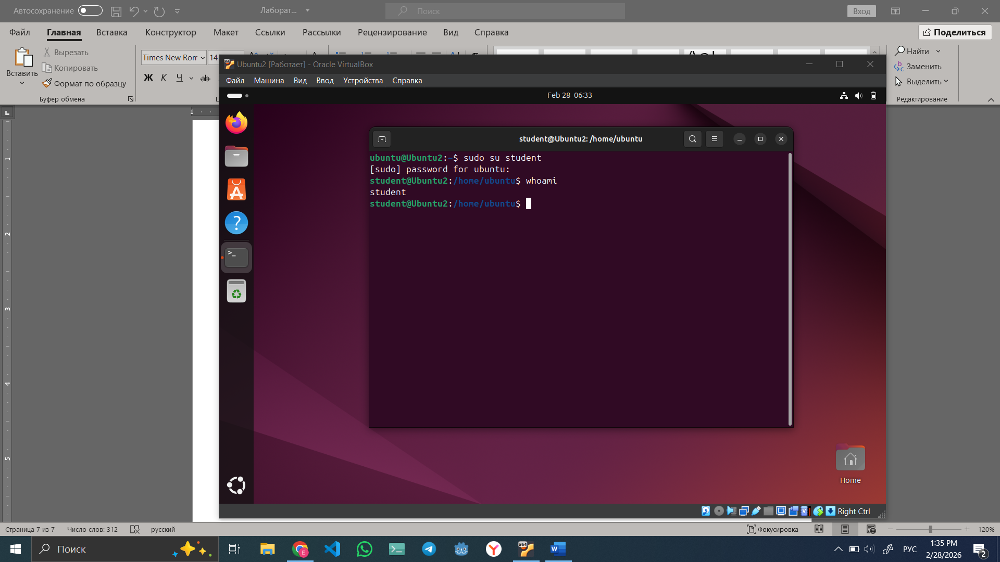

6.  Разбор остальных команд из таблицы 2

  -----------------------------------------------------------------------
  | Команда        |Назначение (область применения)  | Пример использования |  Результат|
                     
  -------------- -------------------- ---------------- ------------------
  halt           Корректное           sudo halt        Система начинает
                 выключение системы.                   процесс завершения
                                                       работы.

  poweroff       Корректное           sudo poweroff    Система
                 выключение системы                    выключается.
                 (аналог halt).                        

  reboot         Перезагрузка         sudo reboot      Система
                 системы.                              перезагружается.

  hostname       Показывает имя узла  hostname         Ubuntu2
                 сети (имя                             
                 компьютера).                          

  uptime         Показывает текущее   uptime           
                 время, длительность                   
                 работы системы,                       
                 количество                            
                 пользователей и                       
                 нагрузку.                             

  users          Краткий список       users            ubuntu ubuntu
                 пользователей,                        
                 работающих в                          
                 системе.                              

  whoami         Показывает имя       whoami           ubuntu
                 текущего                              
                 пользователя.                         

  write          Отправка сообщения   sudo write       Открывается строка
                 другому              student          ввода. После ввода
                 пользователю.                         сообщения и Ctrl+D
                                                       оно появляется на
                                                       терминале
                                                       пользователя
                                                       student2.

  passwd         Изменение пароля     passwd           Запрос старого и
                 пользователя.                         нового пароля для
                                                       текущего
                                                       пользователя.

  ps             Выводит список       ps aux           Длинный список
                 работающих                            всех процессов с
                 процессов.                            PID,
                                                       использованием CPU
                                                       и т.д.

  times          Показывает суммарное times            
                 время исполнения                      
                 процессов.                            

  free           Информация об        free -h          
                 оперативной памяти и                  
                 разделе подкачки.                     

  ifconfig       Настройка/просмотр   ifconfig         Информация об
                 сетевых интерфейсов.                  IP-адресе,
                                                       MAC-адресе и
                                                       пакетах.

  less           Просмотр содержимого less             Открыт файл с
                 файла с прокруткой.  /test/test.txt   пользователями.
                                                       Выход по клавише
                                                       q.

  mkpasswd       Генерация сложного   mkpasswd -l 12   Jk4#pL9\$wQ2r
                 пароля.                               (пример
                                                       сгенерированного
                                                       пароля).
  -----------------------------------------------------------------------

> 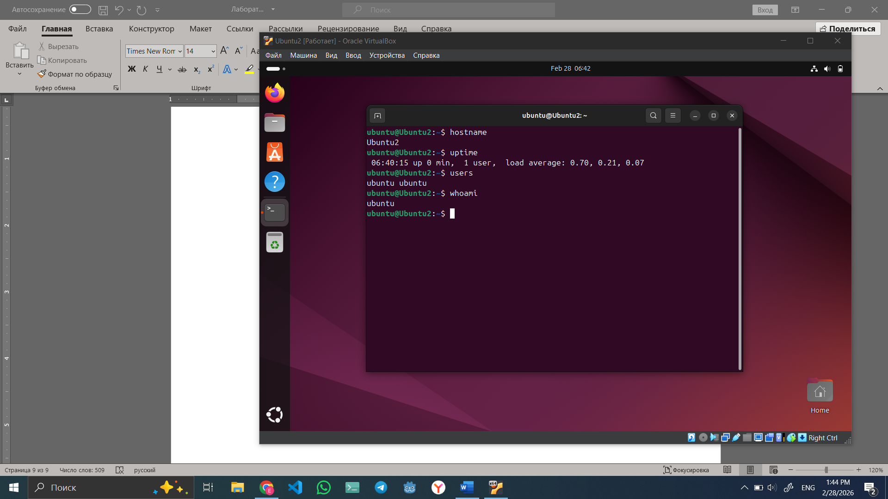
>
> 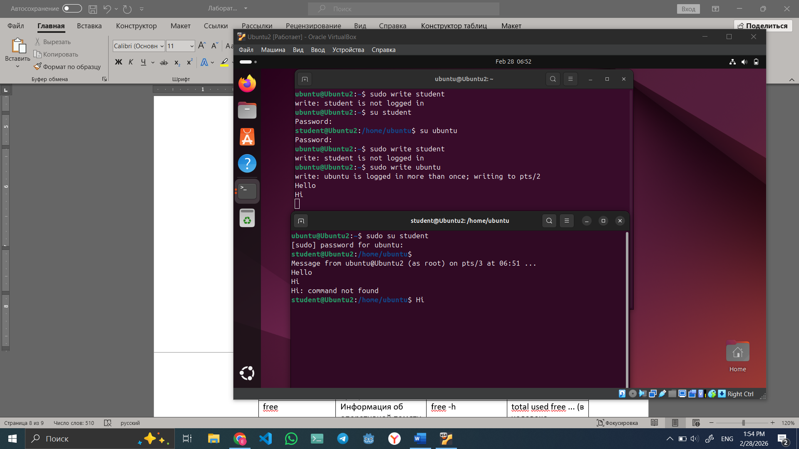
>
> 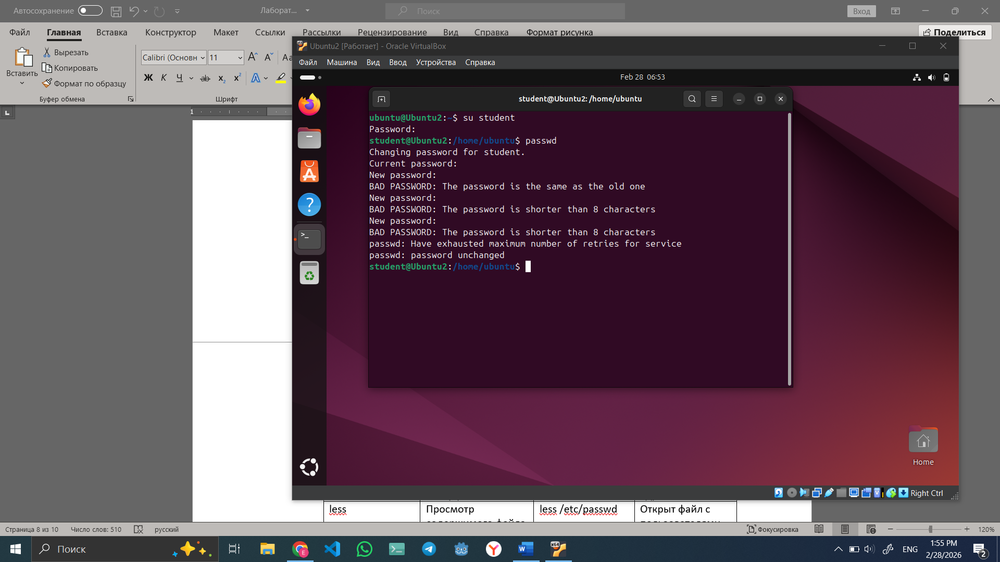
>
> 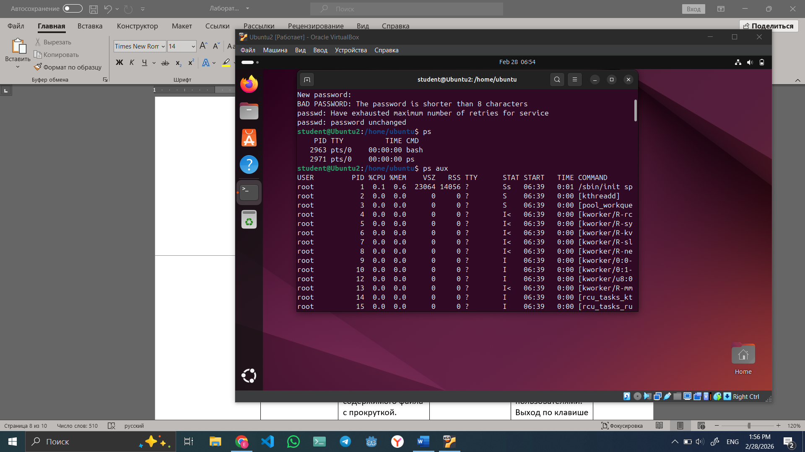
>
> 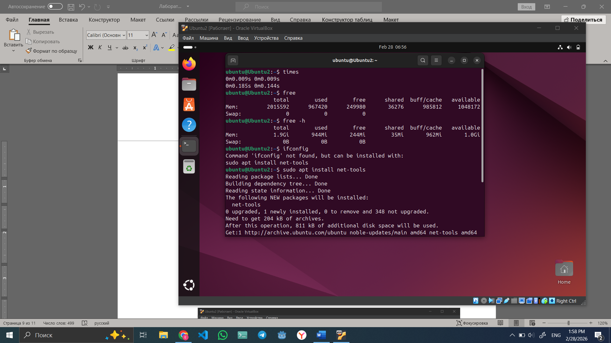
>
> 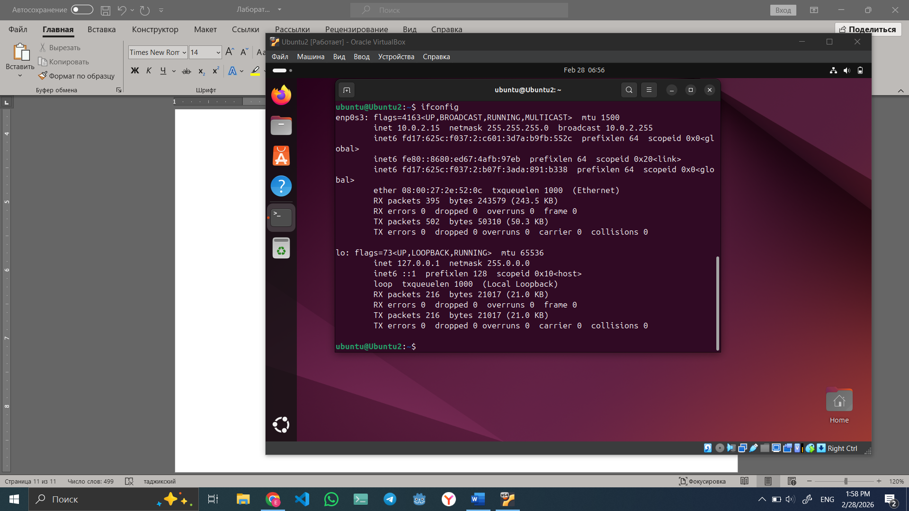
>
> 
>
> 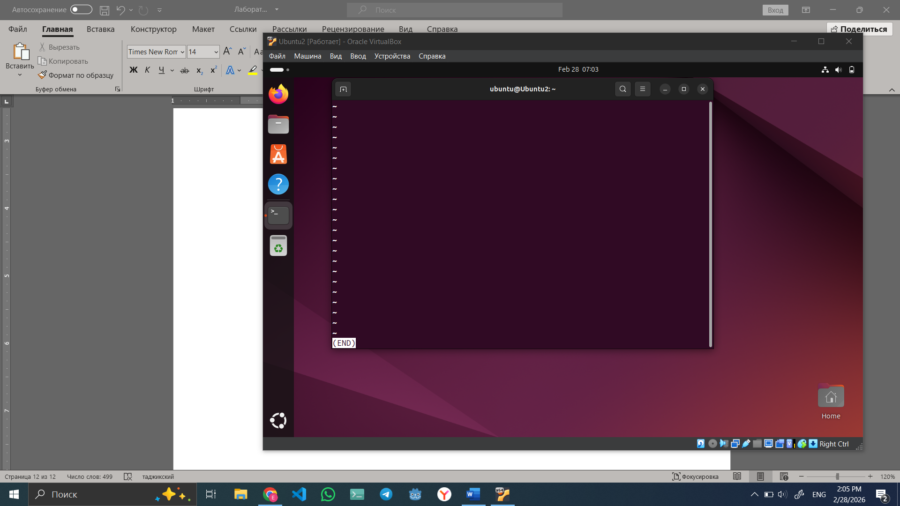
>
> 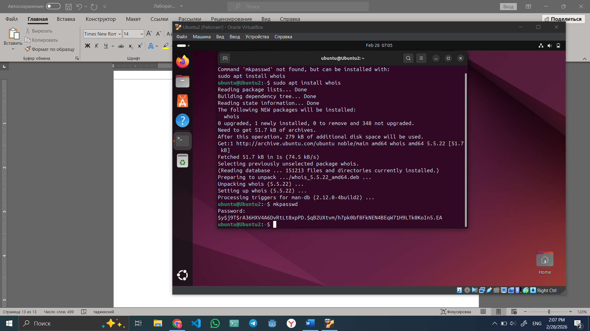
>
> 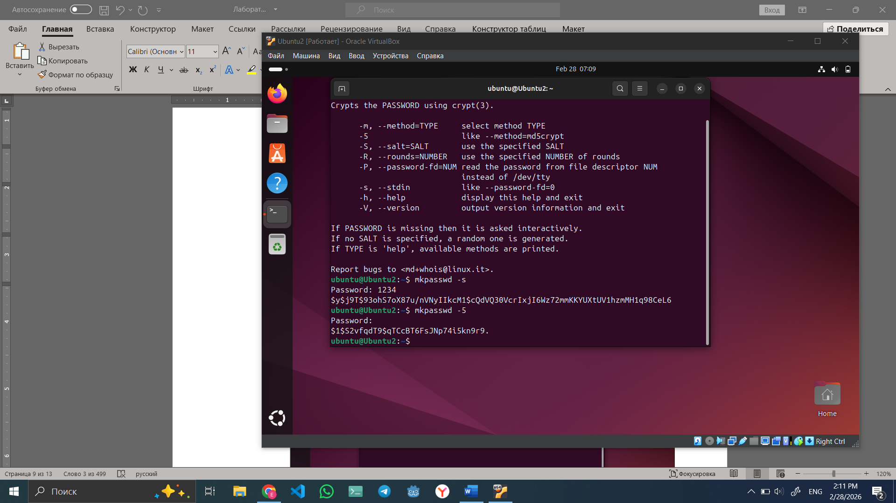
>
> Контрольные вопросы:
>
> 1\. Что такое терминал?
>
> 2\. Перечислите основные системные каталоги.
>
> 3\. Расскажите о типах файлов в ОС Linux.

1.  Терминал (или эмулятор терминала) --- это программа, которая
    предоставляет пользователю доступ к командной оболочке (shell). Он
    принимает текст, вводимый пользователем, передает его оболочке для
    выполнения, и отображает результат (вывод команд и сообщения об
    ошибках). В современном контексте это \"окошко\", в котором можно
    вводить команды Linux.

2.  Основные системные каталоги (согласно таблице 1):

- /bin --- основные пользовательские программы (ls, cp и др.).

- /sbin --- программы для системного администрирования (требуют прав
  root).

- /boot --- файлы загрузчика и ядро системы.

- /home --- домашние каталоги обычных пользователей.

- /dev --- файлы устройств (жесткие диски, терминалы и т.д.).

- /etc --- конфигурационные файлы системы.

- /lib --- системные библиотеки и модули ядра.

- /media, /mnt --- точки монтирования съемных носителей и временных
  файловых систем.

- /proc --- виртуальная файловая система с информацией о процессах и
  ядре.

- /root --- домашний каталог суперпользователя.

- /tmp --- временные файлы.

- /var --- изменяемые данные (логи, очереди печати).

- /usr --- программы пользователя, документация, исходные коды.

3.  В ОС Linux файлы классифицируются не только по содержимому, но и по
    назначению. Основные типы:

<!-- -->

1.  Обычные файлы (- в начале прав доступа): текстовые документы,
    исполняемые программы, изображения, библиотеки. Это просто поток
    байтов.

2.  Каталоги (d): специальные файлы, содержащие список имен других
    файлов и ссылок на них.

3.  Файлы устройств:

- Блочные (b): устройства, работа с которыми ведется блоками данных
  (например, жесткие диски /dev/sda).

- Символьные (c): устройства, работающие потоком байтов (например,
  последовательные порты, терминалы).

4.  Символические ссылки (l): \"ярлыки\", указывающие на другой файл или
    каталог.

5.  Именованные каналы (p): файлы для организации обмена данными между
    процессами.

6.  Сокеты (s): файлы для обмена данными между процессами, часто по
    сети.

