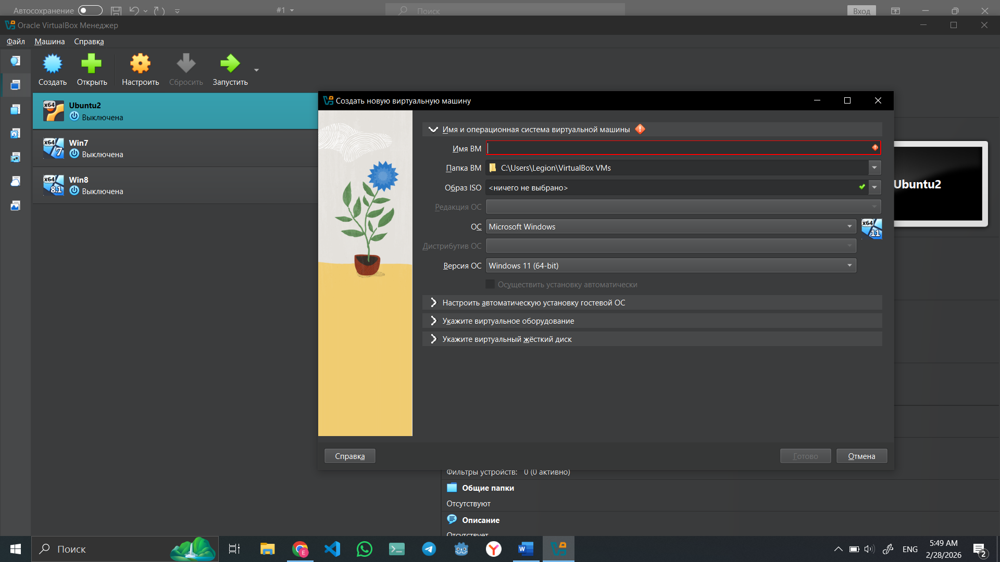
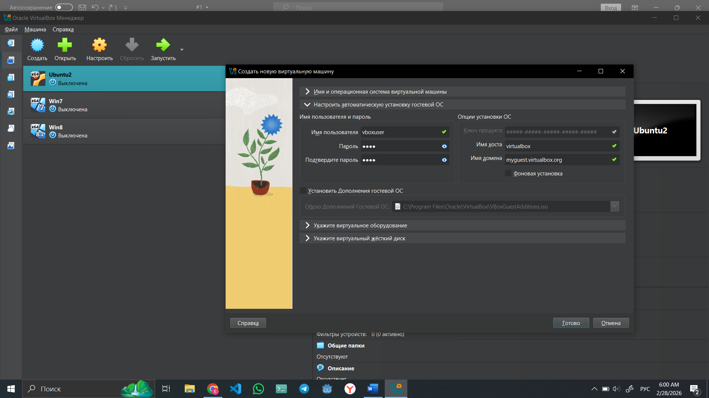
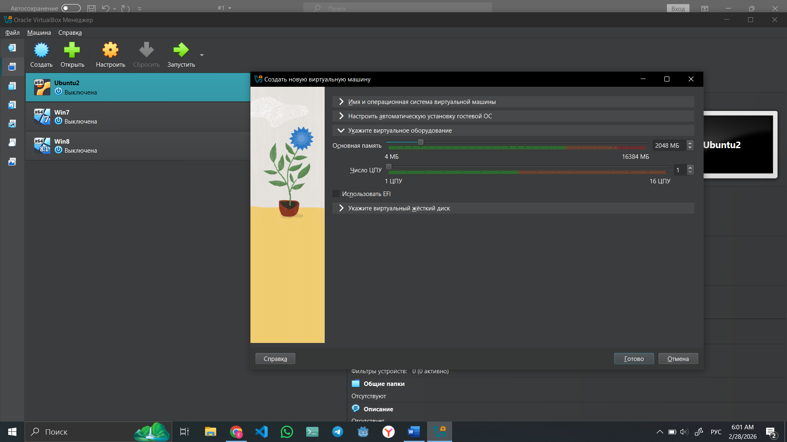
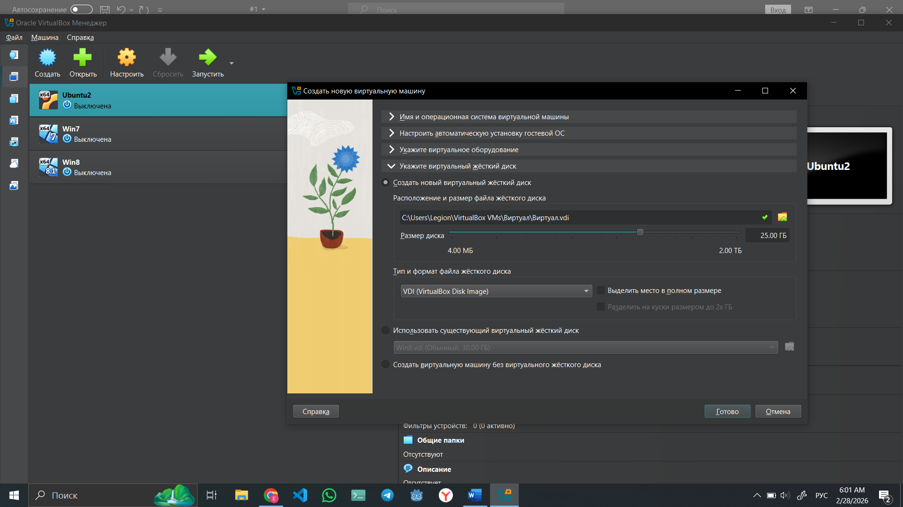
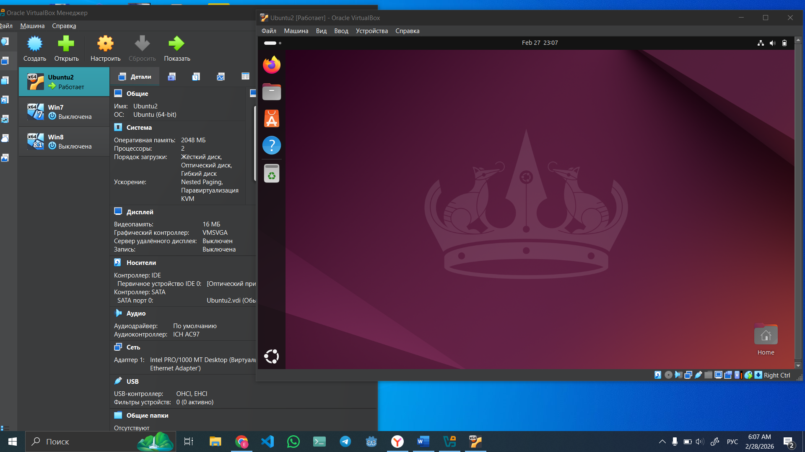
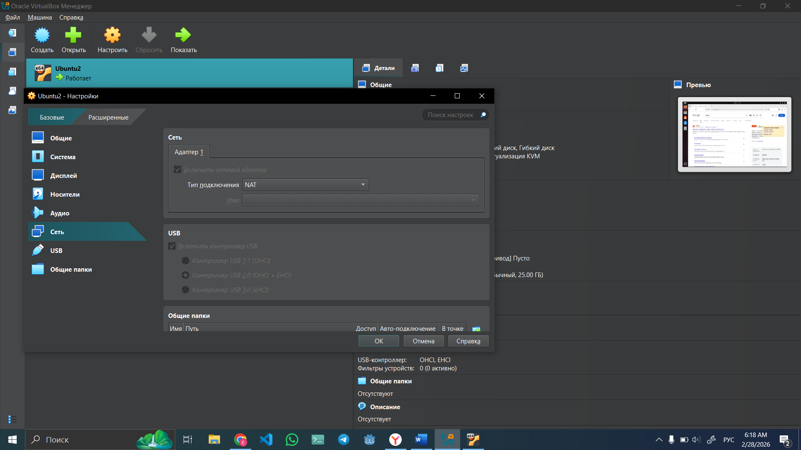
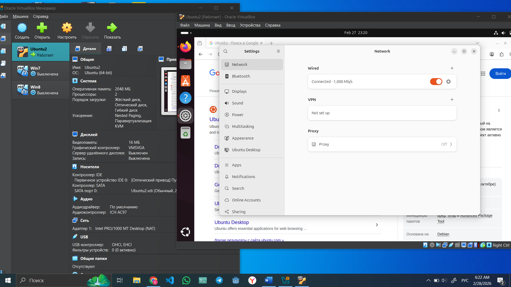
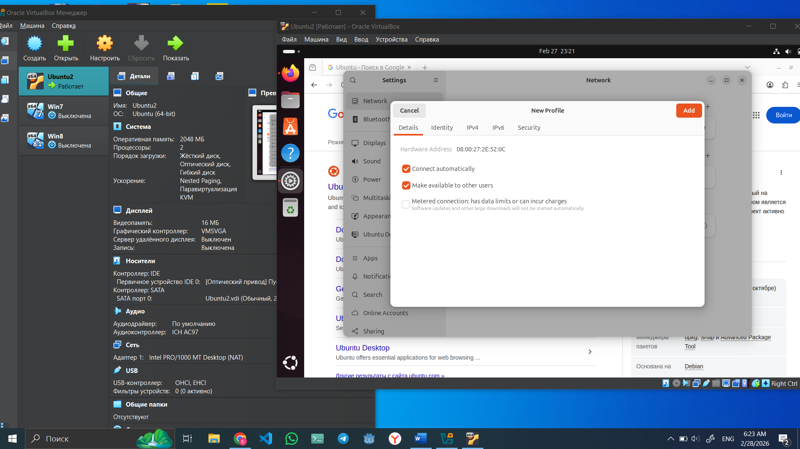
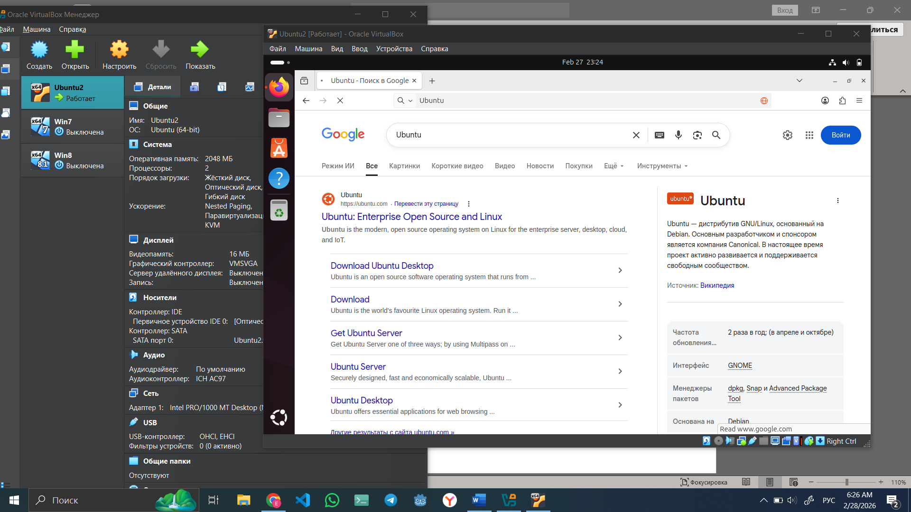
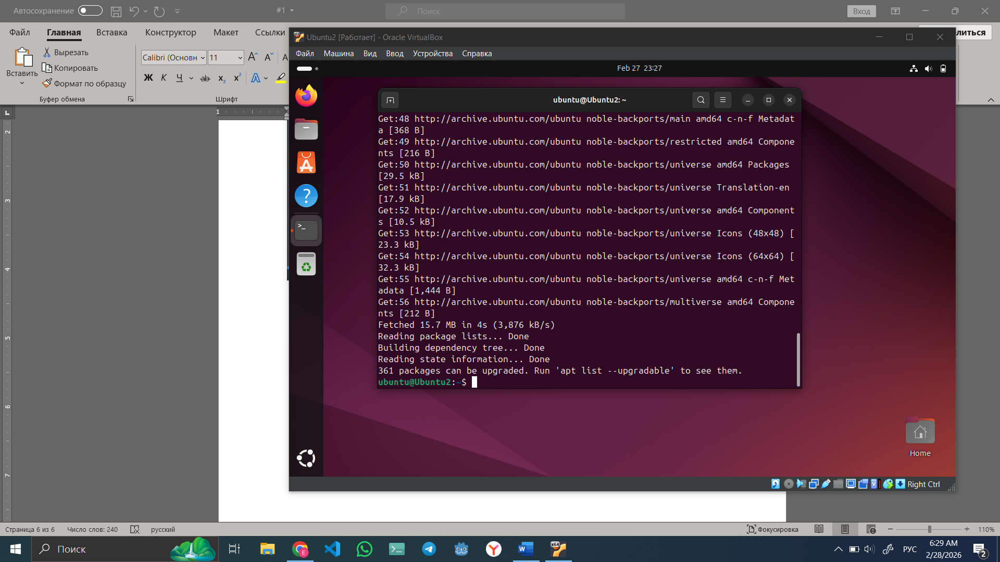

**Задание 1 (10 баллов) Установка операционной системы Linux**

**Создайте виртуальную машину с помощью Oracle VM VirtualBox и выполните
на ней установку операционной системы Ubuntu.**

Так как у меня уже создано ВМ в Oracle VM VirtualBox и установлена ОС
Ubuntu, я просто показываю, как создать и установить:

1.  Нажимаем кнопку Создать в Oracle VM VirtualBox чтобы создать новую
    ВМ;

2.  Задаём имя нашего ВМ и в пункте Обзор ISO, выбираем наш уже
    скачанный ISO образ Ubuntu;

3.  Задаём имя пользователя и пароль;

4.  Указываем ОЗУ, число ЦПУ и размер диска;

5.  Нажимаем Готово;

Рисунок 1 -- Создание новой ВМ

**Выполните настройку сети в Ubuntu и убедитесь в наличии доступа в
интернет с помощью браузера или менеджера пакетов (например, обновив
список пакетов командой sudo apt update).**

После успешно выполненной первого задание перейдём к установку
Ubuntu.Так как у меня она уже установлена, я не собираюсь установить его
заново.

Вот я запустил ВМ. Она готова к исполӣзованию, и выполнена настройка для
доступа к интернету.

Рисунок 2 -- OC Ubuntu в ВМ

Но чтобы подключить нашу ВМ к интернету:

1.  Откроем настройки ВМ → Сеть;

2.  В тип подключения выберем NAT;

3.  Нажимаем ОК.

Рисунок 3 -- Подключение ВМ к интернету

Убедимся что в настройки Ubuntu в пункте Network у нас есть сеть.

Если её нет, то нажимаем + и Add.

Всё. Теперь наша машина подключена к интернету.

1.  Открываем браузер и ищем что ни будь.

2.  Проверим в терминале через команду **sudo apt update** обновив
    список пакетов.

